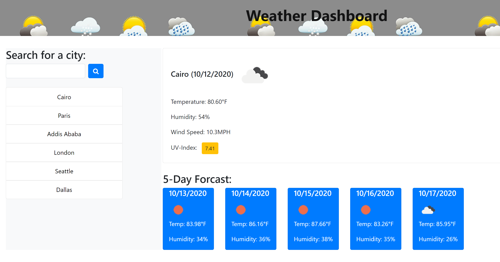

# Weather-Dashboard
  * A simple Weather-dashboard application that allows the user to see the weather outlook for multiple cities.

Explore the [project-page](https://github.com/Mgithub89/Weather-Dashboard.git)

View the [deployed-app](https://mgithub89.github.io/Weather-Dashboard/)

### Table of contents
   * [About The project](#About-The-Project)
   * [Mock-Up](#Mock-Up)
   * [Built With](#Built-With)
   * [Contact](#Contact)

 ## About The Project 
  
   The objective of this project is to create a weather dashboard application that allows a user to see current weather and five day forcast for any searched cities by using third party API based on a user acceptance criteria.
  This app uses the **OpenWeather API** to retrive current weather data and five day forcast data for cities.
  When a users enter a city name and click the search icon the user presented with current weather that shows Temprature, Humidity,Wind speed and UV-Index and  a 5-day forecast that displays the date, an icon representation of weather conditions .

## Mock-Up

## Built With 
   *  HTML
   *  Bootstrap - CSS Framework
   *  Jquery - JavaScript Library
   *  Moment.js - JavaScript Library
   *  OpenWeather Api
    

## Contact
Metages Worku - [metages09@gmail.com](mailto:metages09@gmail.com)
